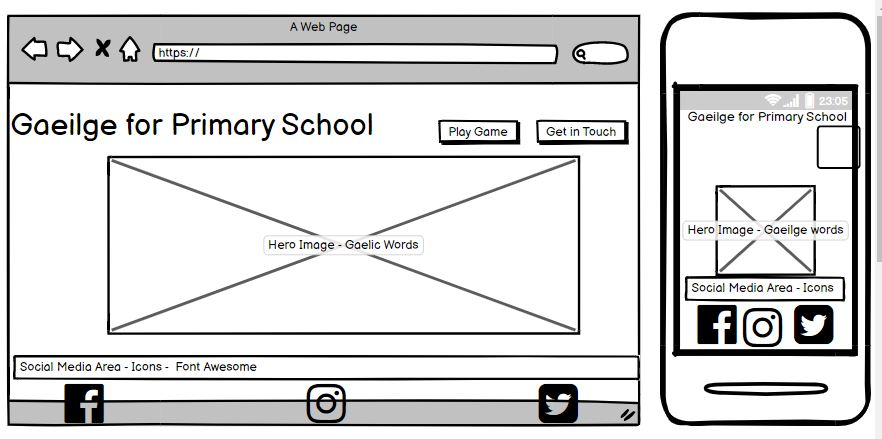

# **Learn Gaeilge for Primary School**



[View live version of website via GitHub Pages](https://ctoweyburke.github.io/MS2GaeilgeMemoryGame/)

Every young person needs to enjoy learning. The aim of this webpage is to create a fun, engaging memory game to learn some key words in Gaeilge and develop their knowledge. 

## **Goal for this project** 
- To be a resource for young children to learn key words in Gaeilge.
- To be a customisable to suit the Primary Curriculum in Ireland. 
- To be a tool that teachers can use for learning which is interactive.
- To help people find further resources through the links on the page or ask for further information through the “Get in touch page”.

<a></a>
## Table of contents 
* [UX](#ux)
    * [User Persona] (#user-persona)
    * [Who](#who)
    * [User Goals] (#user-goals) 
    * [Site Owners Goals] (#site-owners-goals) 
    * [User Stories] (#user-stories)
    * [User Requirements and Expectations] (#user-requirements-and-expectations)
        * [Requirements](#requirements)
        * [Expectations](#expectations)
    * [Design](#design)
        * [Icons](#icons)
        * [Colours](#colours)
        * [Logo](#logo)
* [Wireframes](#wireframes)
* [Features](#features)
    * [Existing Features] (#existing-features)
    * [Features to be implemented] (#features-to-be-implemented)

* [Technologies used] (#technologies-used)
    * [Languages](#languages)
    * [Libraries](#libraries)
    * [Tools](#tools)
    * [Design](#design)
* [Testing](#testing)
* [Deployment](#deployment)
* [Credits](#credits)

<a name="ux"></a>
## **UX**

<a></a>
### **User Persona**
This website is a tool for users who are teaching Primary Irish “Gaeilge” to their classes. This site includes home page where the learners have the opportunity to learn the words and match to the pictures. The users want to use this website as a learning aid within lessons for visual learners. The users are comfortable with using technology, and through the era of home-schooling it could also support Parents and Teachers alike.

<a></a>
### **Who**
Who are we building this website for?
- Teachers who are teaching interactive lessons or parents who are home schooling at present.

<a></a>
### **User Goals**
- Have a view of the words and pictures what will come up in their memory game and be able to match the words and pictures when asked.
- To see the pictures and words below so they can learn the “Gaeilge” words
- To see what they may already know
- To see the words they need to learn
- Easily find icons for further learning – GaeilgeVibes through social media apps (online)
- To “get in touch” if they have comments or require further information.

<a></a>

### **Site Owners Goals**
- Educational resource to be developed for Primary school children in Ireland to make learning fun and interactive.
- Help users learn key words that relate to their primary curriculum.
- Gain insights from users what they enjoyed/want to see added

<a></a>
### **User Stories - Children**
* As a beginner to the Irish Language, I want to be able to see the picture and word so I can learn this way. 
* As a teacher, I want to make sure that I can challenge the learners in my class by showing them the pictures and asking them say the Irish words. 
* As a user when I play the game I want to see if I can match 2 key cards together and learn the words this way.
* As a teacher, I want to be able to assess my learners on their memory and assessment of their learning of key Irish words. 
* As a user I want to be able to look for further sites/information about Gaeilge.
* As a teacher, I want to be able to find further resources online.
* As a learner/user, I want to be able to get in touch with the webpage-developers to let them know how they could improve this site for my learning. 
* As a user, I want to be able to follow or connect with the creator of the site on social media

<a></a>
### **User Requirements and Expectations**
<a></a>
#### Requirements
* Easy to navigate by using the navigation menu.
* Relevant content in the home page and game.
* Appealing visual elements.
* Easy way to contact site owner to give feedback or suggestions for improvement.

<a></a>
#### Expectations
* When clicking on links (social media links), expect the page to open in a separate browser.
* Expect that the navigation links work properly to take the user where they intended to go to from page to page.
* Instructions for game - Click on the START Button before game and timer starts.
* Expect card game to work to match up the correct cards for user to enjoy the game and learning experience. 
* Expect to get results from your game in terms of the length of time it took you, how many flips also.
* Expect feedback when submitting the contact form that the form has been submitted correctly.
* Clear map of our company location.

<a></a>
### **Design**
As the central theme of the website is Gaeilge-Irish, I made all my design choices based on the Irish Flag colours & elements.
I researched images and websites of Ireland, flag, Irish language to get inspiration for the colour scheme.

#### Fonts
I used [Google Fonts] (https://fonts.google.com/ "Google Fonts") to explore the various options.
For the overall content I have decided to use the [Indie-Flower](https://fonts.google.com/specimen/Indie+Flower") Google fonts: Indie-Flower") font. 
I chose this font as it is very similar to a handwriting font and I would expect younger children would be more comfortable with
this font as opposed to a more modern or office type font. It is easy to read and creates a young environment for the pages. 

<a></a>
#### Icons
I used icons from 
[Font Awesome library] (https://fontawesome.com/ "Font Awesome"). 
The icons that were used are used to give meaning to a certain section - Social Media Icons that are very familiar to all users. 

<a></a>
#### Colours
The colour scheme is based on Ireland/Irish Flag colours. I wanted it to relate to the subject of Gaeilge – Irish language. 
I used #FFA500 for Orange and #008000 for Green in the project. I did use some other colors as background and 
#800000 for message that pops up when the game finishes. 

https://www.w3schools.com/cssref/css_colors.asp

<a></a>
#### Logo
I used a logo using an Irish Flag I found on Google images. (assets/images/irishflag.jpg) 

<a></a>
## **Wireframes**
I have used [Balsamic](https://balsamiq.com/wireframes/) to create my wireframes. 
First I created a basic wireframe for mobile & desktop. 
For my website, I have decided to go for a 3-page website which suits young people to navigate directly to key areas.
I did feel if I put my webpage all on 1 page it would be over whelming and the user may get lost looking for the game.

The website will be easy to navigate by using the buttons at the side of the page to bring the user to home/game/get in touch page. 


<a></a>
### Wireframe images:
#### These are both mobile and desktop layouts. So the user can visualise using them on either device. Looking at it completed, I
feel that this website would be used more by a teacher on a whiteboard - so desktop was the best design.
- [home page](wireframes/index-homehtml.jpg)
- [game page](wireframes/gamehtml.jpg)
- [Get in Touch](wireframes/contacthtml.jpg)

<a></a>
## **Features**
- Three Page Site with Home Page, Game Page and Get in touch Page.
- This site is designed to be used as a desktop by a teacher in a class so my main design was desktop, then i decided to make it ipad
responsive also and iphone. 

### Home Page  (Index.html)

1. Mobile & Tablet - webpages re-size down to fit device.
2. Desktop - Large screen - User can see 3 pages - Home/Game/Get in touch.
3. Home Page - Clear instructions to learn the words. Game & Get in touch Button on Screen along with Social Media Links
4. Large Picture with key words and pictures to aid learners. 
5. Social Media links at bottom - font Awesome icons - easily understood.

### Game (game.html)
1. User MUST click on the START GAME button to start the timer and the game. This is why this text is flashing so that 
it drawas the users attention. 
2. Cards are locked and will only turn when the START button is clicked.
3. Instructions are given to the user to click on the start button to start the game - flashing text.
4. A reset button is also available for users to reset if they want to start the game again.
5. An message will appear when the user matches all the cards to give them information on the time it has taken them, and 
how many flips also. 

### Get in Touch (Contact.html) 
1. A form is available on this page for the user to get in touch.
2. There is a space for name, email and a message to be submitted.
3. A submit button is available. 
4. Company information, contact email and phone number along with some info on the company (fictional)
5. A map is also available with the region where this (fictional) company is located - with marker for head office. 


<a></a>
### **Existing Features**
#### Pages
- Navigation Bar - Allows the user to easily navigate the website's sections and find what they are looking for with ease and speed.
- Game Page - Allows the user to go directly to the game and play.
- Get in Touch Page - Allow user to see fill in a contact form to send feedback or ask questions. 
- Also, a map on this page to show the location of the company. (as it is not a real company – location map is regional)
- Social Media Links to “Gaeilge Vibe” which is an Irish Language area (use for Educational Purpose for this project only)
- Hamburger menu when using phone 

<a></a>
### **Features to be implemented**
- A unique environment for the user where they can sign in with a user name and password so that their information can be saved across devices - will need further skills to implement this feature.
- A feature to record each attempt and score - will need further skills to implement this feature.
- Add reCAPTCHA security function in form - will need further skills to implement this feature.
- Further work required for mobile responsive site as several issues incountered when setting @media screen below 375px.
- Further topics would be added so the user could chose the subject example - learn irish words, house words, farm animals expect.
- Clear the form after the user has submitted a message.
- User to get an email with details of what they have submitted as a message. 

<a></a>
## **Technologies used**
<a></a>
### **Languages**
- This project uses HTML, CSS and JavaScript programming languages

<a></a>
### **Libraries & Frameworks**
- [Bootstrap](https://www.bootstrapcdn.com/)
    - The project uses **Bootstrap4** to simplify the structure of the website and help make the website responsive easy to do.
- [Font Awesome](https://fontawesome.com/)
    - The project uses Fontawesome for the icons
- [Google Fonts](https://fonts.google.com/)
    - The project uses **Google fonts** to style the website fonts.
- [Emailjs API](https://www.emailjs.com/)
    - The project uses an API from **Emailjs** for the contact form.
- [Google Maps API](https://developers.google.com/maps)
    - The project uses an API from **Google** for the map interaction and map markers

<a></a>
### **Tools**
- [Gitpod](https://www.gitpod.io/) - This developer used **Gitpod** for their IDE while building the website.
- [Github](https://github.com/)
    - The project uses **Github** for hosting and version control.

<a></a>
### **Design**
- [Balsamiq](https://balsamiq.com/)
    - To design mockups and wireframe


<a></a>
## **Testing**

For this project, the web developer tools built directly into the Google Chrome browser was used to help edit pages 
and diagnose problems quickly.
- [W3C Markup Validator](https://validator.w3.org/) 
Results - 
(testing/validatorw3results.jpg)
    - For testing HTML code - some issues noted and addressed.
- [W3C CSS Validator](https://jigsaw.w3.org/css-validator/)
    - For testing CSS code
    Results
    (testing/w3cCSSvalidation.jpg)
    -  Issues were identified but related more to the libraries than the CSS I felt?
- [JSHint Validator](https://jshint.com/)
    - For detecting errors and potential problems in your JavaScript code
     Results
     (testing/email-jstest.jpg) (testing/jsgametest.jpg)
- [Link Checker](https://validator.w3.org/checklink)
    - For checking all links on the website and see if all links work. Result - external links not working - but they have
    been tested and are working myside.
    Results
    (testing/linkstests.jpg)
- Lighthouse in Google dev tool
    - For testing the performance of the website
    Results - (testing/lighthousetest.jpg)


<a></a>
## **Deployment**

This project was developed using the [Gitpod IDE](https://www.gitpod.io/), 
committed to git and pushed to GitHub using the built-in function within Gitpod. 
After writing the code, committing and pushing it to GitHub:

#### Log into GitHub.
* Navigate to the repository on github and click **Settings**.
* From there, go to the **Source section** within the Github Pages section.
* Select **master branch** on the dropdown menu, and click save.
* Now the website is live on:

```
https://yourgithubusername.github.io/your-repo-name
```
* Any time commits and pushes are sent to Github, the Github Pages site should update shortly after.

To deploy this page to GitHub Pages from its [GitHub repository](https://github.com/Franciskadtt/voyager), the following steps were taken:

At the moment of submitting this Milestone project the Development Branch and Master Branch are identical.

### How to run this project locally
To clone this project into Gitpod you will need:

1. A Github account. Create a Github account [here](https://github.com/)
2. Use the Chrome browser

Then follow these steps:

1. Install the Gitpod Browser Extensions for [Chrome](https://www.gitpod.io/docs/browser-extension/)
2. After installation, restart the browser
3. Log into [Gitpod](https://www.gitpod.io/) with your Gitpod account.
4. Navigate to the [Project GitHub repository](GITHUB LINK HERE)
5. Click the green "Gitpod" button in the top right corner of the repository
6. This will trigger a new gitpod workspace to be created from the code in GitHub where you can work locally.

To work on the project code within a local IDE:

1. Follow this link to the [Project GitHub repository](GITHUB LINK HERE).
2. Under the code button, click "Clone" or "Download Zip".
3. In the Clone with the HTTP section, copy the clone URL for the repository.
4. In your local IDE open the terminal.
5. Change the current working directory to the location where you want the cloned directory to be made.
6. Type git clone, and then paste the URL you copied in Step 3.
7. Press Enter. Your local clone will be created.

### How to ensure Google API works
The API key is a unique identifier that authenticates requests associated with 
your project for usage and billing purposes. You must have at least one API key associated with your project. 
The API key in t

To create an API key:

1. Google maps require you to restrict your API key to certain URLs. 
Therefore you will have to create a [Google](https://developers.google.com/maps/documentation/javascript/get-api-key) 
account and get your own key.
2. Go to the APIs & Services 
3. Go to the Credentials page
4. On the Credentials page, click Create credentials. The API key created dialog displays your newly created API key.
5. Click Close.
6. The new API key is listed on the Credentials page under API keys. (Remember to restrict the API key before using it in production.)

### How to ensure EmailJS API works

Set up EmailJS account
1. Create an [EmailJS](https://www.emailjs.com/) account
2. Create an email template: click on the Email Template section on the left-hand side.
3. Click Create new template up at the top
4. Choose the blank template 
5. Fill in the template and say where we want the email to be sent to - click save
6. Click on the Test button up at the top

Connecting to EmailJS
1. Go to the EmailJS website then documentation
2. Click on installation and copy the EmailJS SDK
3. Copy the code and paste the code in before the closing/head tag
4. Get your user ID - you can get this from the Instructions page in the EmailJS dashboard.
5. Paste it into your emailjs.init(). You can copy your custom EmailJS code 
(relating to parameters) and paste it into your JavaScript.

<a></a>
## **Credits**

### Content
- The idea and text for this website was created by Claire Burke, owner of the site. 
- With a background in teaching and having children, learning IRISH is a challenge so I wanted to create 
a medium through which my children would like to learn, enjoy and have fun.

### Media 
- Images used are from [google](https://www.google.com/ "Google images")

### Code
- HTML for the navbar and form originally taken from Bootstrap with modifications for this project.
- Some HTML written using Bootstrap, others writen by owner.
- CSS for social links from Code Institute Rosie Project
- JS for game based on tutorial by https://marina-ferreira.github.io/tutorials/js/memory-game/. 
- JS for Start Game/Timer/Reset - written by C Burke with tutorial from https://www.w3schools.com/
- JS for email (API) written with tutorial by Code Institute 
- JS for google maps (API) written with tutorial by Code Institute.

### Acknowledgements
- Thanks to my mentor Gerry for guiding me through this project. He helped to brainstorm about the project and what was achievable. 

- Thanks to my brother Ian, who guided me through emailjs – API and answering several questions I had
through this process.


